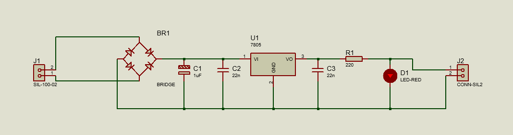
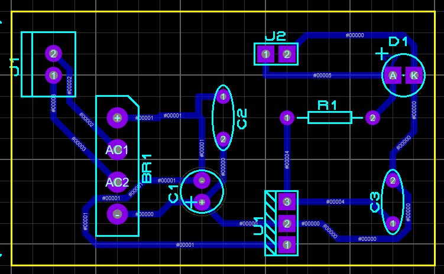
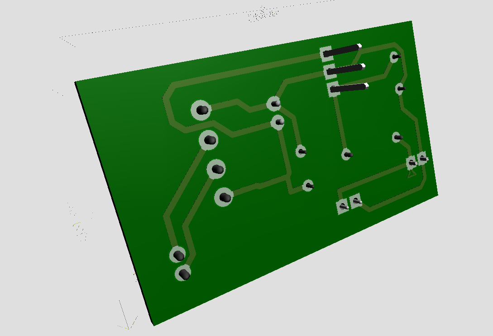
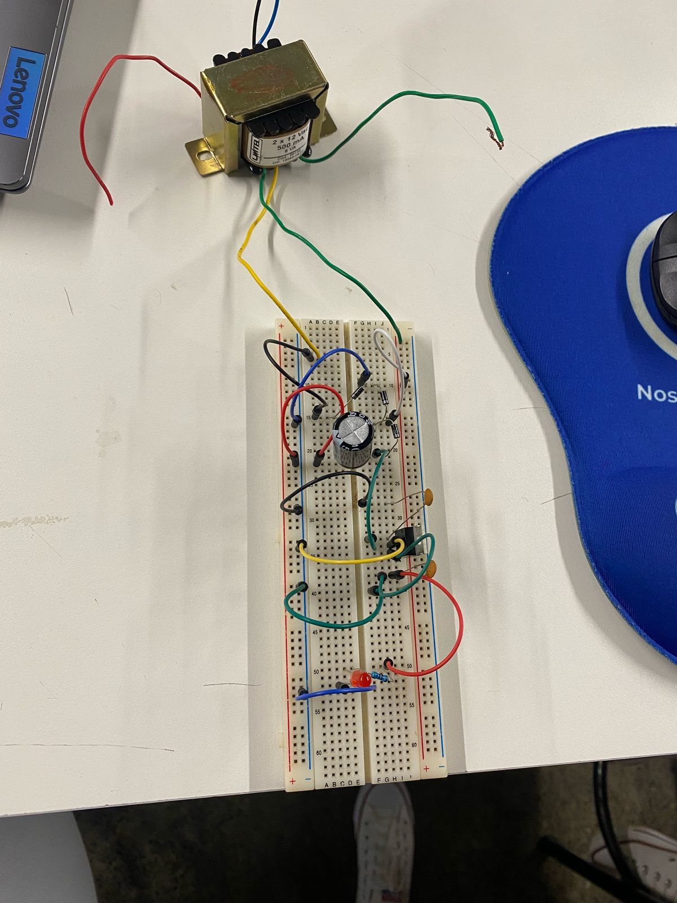
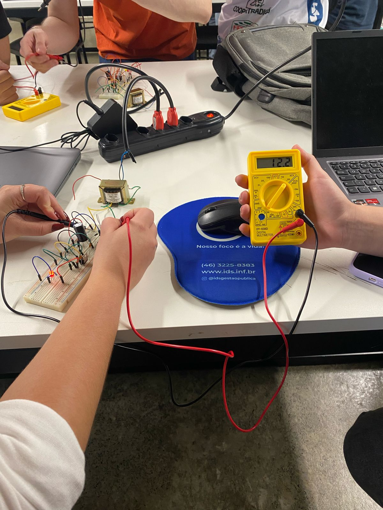
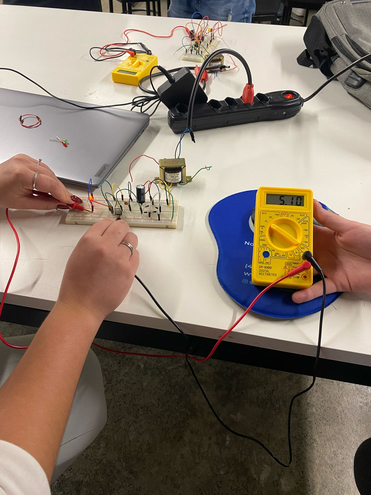

# Retificador de Onda Completa  

## 📖 Descrição  
Este projeto consiste em um retificador de onda completa, desenvolvido utilizando o software Proteus para a criação do esquemático, simulação do circuito e design da placa de circuito impresso (PCB). O projeto também inclui um modelo 3D da PCB, permitindo uma visualização detalhada da montagem dos componentes.

## 📜 Esquemático do Circuito  

## PCB 

## 🛠️ Modelo 3D
### Frente  

### Traseira  

## 📷 Fotos do Protótipo  
  
  

