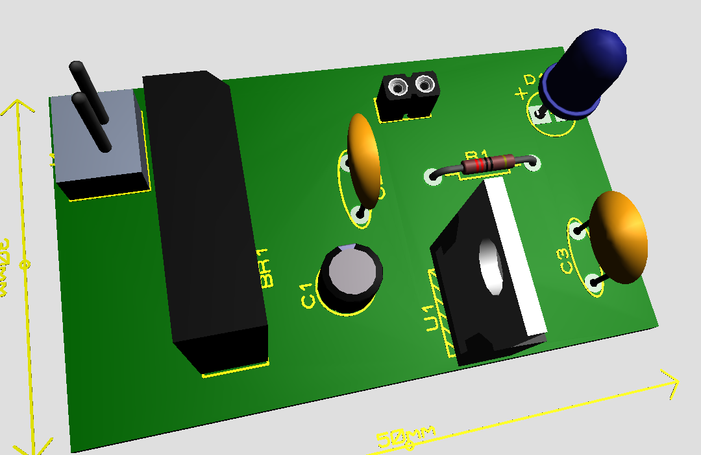

# ⚡ Retificador de Onda Completa  

## 📖 Descrição  
Este projeto apresenta um **retificador de onda completa**. O design foi elaborado utilizando o **Proteus**, onde foram realizadas a criação do esquemático, simulação do circuito e o design da **placa de circuito impresso (PCB)**.  

Além disso, um **modelo 3D** da PCB foi gerado para proporcionar uma visualização detalhada da disposição dos componentes.  

## 🔧 Esquemático do Circuito  
Abaixo está o **esquemático do circuito**, representando a estrutura e os componentes utilizados no projeto:  
  

## 🖥️ Design da PCB  
O layout da **placa de circuito impresso (PCB)**
  

## 🛠️ Modelo 3D da PCB  
Para facilitar a visualização e montagem, foram gerados modelos 3D da PCB, mostrando sua estrutura frontal e traseira.  

### 🔹 Visão Frontal  
  

### 🔹 Visão Traseira  
  

## 📷 Implementação Prática  
A seguir, algumas imagens do circuito em teste, demonstrando o funcionamento do retificador e sua validação experimental.  

  
  
  

